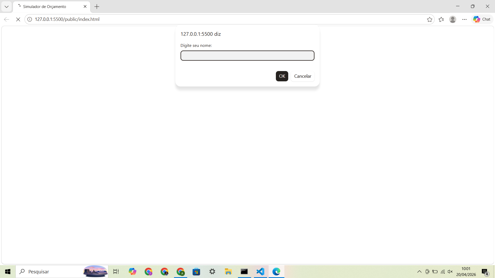
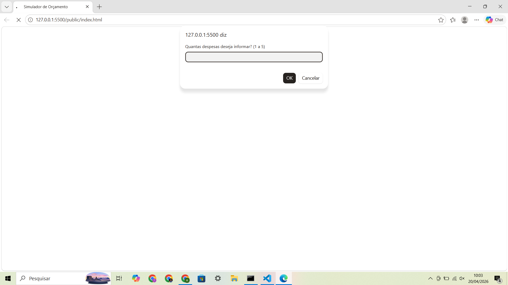
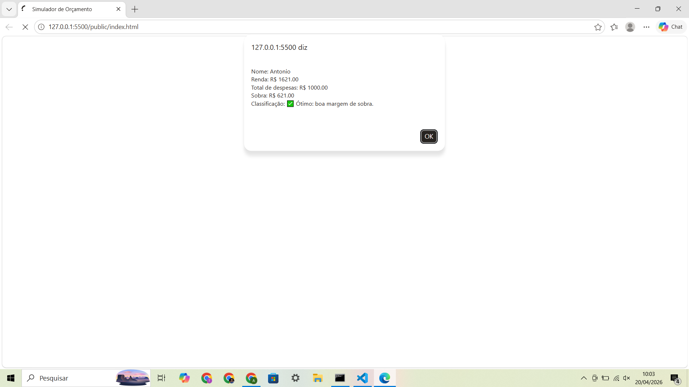

# Trabalho Prático - Semana 7

Nessa atividade, vamos dar os primeiros passos com JavaScript, praticando com a criação de variáveis, emprego de tipos básicos (string, number, boolean), operadores, além de fluxos de controle condicionais e estruturas de repetição (for e while).

## Informações Gerais

- Nome: Antônio Cardoso
- Matricula: 853577

## Print do console do navegador

<<  COLOQUE A IMAGEM AQUI >>

(*) Utilize as ferramentas do desenvolvedor do seu navegador para colocar no modo reponsivo, escolha um celular qualquer e recarregue a página antes de tirar o print. 